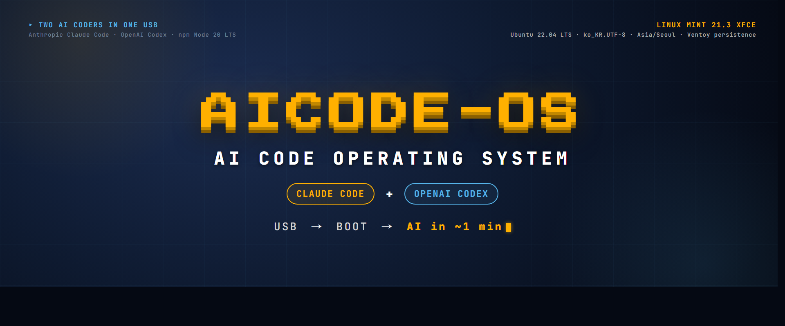

# AICODE-OS — Claude + Codex LiveUSB



**AI 코더 두 명 (Anthropic Claude Code + OpenAI Codex CLI) 이 동시에 탑재된** 부팅 가능한 LiveUSB ISO. Linux Mint 21.3 XFCE 기반.

DHCP 방식으로 IP가 자동으로 잡힙니다. 유선랜과 무선랜을 지원합니다. 무선은 AP(공유기) 를 선택하는 메뉴를 통해서 접속할수 있습니다.

USB 한 개 꽂고 부팅하면 — `cco` 사용자 자동 로그인 → XFCE 데스크톱 (Wi-Fi GUI, 한글 입력, Firefox 내장) → **xfce4-terminal 한 창에 두 탭 자동** (좌탭: Claude Code, 우탭: OpenAI Codex). OAuth 한 번이면 끝. Wi-Fi 비번 / 작업물 / 설치한 패키지 전부 Ventoy persistence 로 영구 저장.

> "v2.0" 부터 Linux Mint 21.3 XFCE 기반. 이전 Alpine v1.0.x 시리즈는 [`archive/alpine-v1/`](archive/alpine-v1/) 참조.

> 🙏 **v2.0.5 개선**: 스레드 사용자 **@imusiro** 님의 "dat 파일 어디서 받나?" 의견을 반영. Release 에 `cco-persistence.dat.xz` (543 KB 압축본, 풀면 3.5 GB) 추가 + `make-persistence.sh` 자동 생성 스크립트 박음. 이제 dat 직접 만들 필요 X.

> 📋 [Full changelog](CHANGELOG.md) · [Install guide](INSTALL.md)

"Languages": [한국어](#한국어) · [English](#english)

---

## 한국어

### 왜 이렇게 만들었나

AI 와 대화 한 번 하려고 — Windows 깔고, 드라이버 잡고, 브라우저 깔고. 또는 Linux 깔고, Node 깔고, `npm install` 하고, 로그인하고. 단계가 너무 많습니다.

AI 가 인터페이스 그 자체인데, 왜 그 앞에 OS 와 설치 과정을 끼워두는가. 그래서 OS 자체를 AI 로 만들었습니다.

부팅 → 30초 → 인증 → AI.

### 박힌 항목 (v2.0.5)

- "base": Linux Mint 21.3 XFCE (Ubuntu 22.04 LTS jammy)
- "Anthropic Claude Code" (npm `@anthropic-ai/claude-code`) — 좌탭 자동 시작
- "OpenAI Codex CLI" (npm `@openai/codex`) — 우탭 자동 시작 (한 창 두 탭)
- "node v20 LTS" + "firefox" 내장 (OAuth 인증용)
- "NetworkManager + nm-applet" — Wi-Fi GUI 트레이
- "ibus + ibus-hangul" — EN+KO 자동 등록 (`Shift+Space` 토글)
- "fonts": Noto CJK KR (시스템 11pt), D2Coding 13pt (터미널)
- "locale": ko_KR.UTF-8 + Asia/Seoul timezone
- "lightdm autologin" = `cco` (sudo NOPASSWD)
- "Mint-Y-Dark-Aqua" 테마 + AICODE-OS wallpaper (Wong palette colorblind-safe)
- "persistence": Ventoy `casper-rw` 매핑 → 모든 변경 영구 저장

### 사용법

#### 1. ISO 다운로드 (권장)
[Releases](https://github.com/Hostingglobal-Tech/claude-code-os/releases) 에서 v2.0.5 의 세 파일 다운로드:
- `aicode-os-v2.0.5.iso.part1` (1.99 GB)
- `aicode-os-v2.0.5.iso.part2` (1.65 GB)
- `aicode-os-v2.0.5.iso.sha256`

ISO 가 GitHub Release 단일 한도 (2 GB) 초과로 두 part 로 분할되어 있습니다. 합치기:

Linux / WSL / macOS:
```bash
cat aicode-os-v2.0.5.iso.part1 aicode-os-v2.0.5.iso.part2 > aicode-os-v2.0.5.iso
sha256sum -c aicode-os-v2.0.5.iso.sha256
```

Windows (cmd):
```cmd
copy /b aicode-os-v2.0.5.iso.part1+aicode-os-v2.0.5.iso.part2 aicode-os-v2.0.5.iso
```

#### 1-1. (선택) 직접 빌드
```bash
mkdir -p ~/aicode-build/branding && cd ~/aicode-build
# Linux Mint 21.3 XFCE 64bit ISO 다운로드 (https://www.linuxmint.com/edition.php?id=302)
git clone https://github.com/Hostingglobal-Tech/claude-code-os repo
cp repo/build-mint.sh .
cp repo/branding/cco-wallpaper.png branding/

# 빌드 (mksquashfs ~30분, 전체 ~35분)
sudo bash build-mint.sh
# → aicode-os-v2.0.5.iso (~3.4 GB)
```

빌드 의존성: `xorriso`, `unsquashfs`, `mksquashfs` (`squashfs-tools`, `xorriso` 패키지)

#### 2. Ventoy USB 준비
[Ventoy](https://www.ventoy.net/) 으로 USB 포맷 (8 GB+ 권장).

#### 3. ISO + persistence dat 복사
```
F:\aicode-os-v2.0.5.iso       (3.4 GB)
F:\cco-persistence.dat        (3.5 GB, ext4 label=casper-rw)
F:\ventoy\ventoy.json
```

`cco-persistence.dat` 준비 — 두 가지 방법 중 선택:

**방법 A (권장): Release 에서 미리 만든 압축본 다운로드**
- [Releases v2.0.5](https://github.com/Hostingglobal-Tech/claude-code-os/releases/tag/v2.0.5) 에서 `cco-persistence.dat.xz` (543 KB) 다운로드
- 압축 풀기:
  - Linux/WSL/macOS: `xz -d cco-persistence.dat.xz` → 3.5 GB `cco-persistence.dat`
  - Windows: 7-Zip 으로 `cco-persistence.dat.xz` 우클릭 → "여기에 압축 풀기"

**방법 B: 직접 생성 — 더 큰 사이즈 원할 때**

> ⚠️ **USB 파일시스템 한계 주의**:
> - **FAT32 USB** = single-file **최대 4 GB**. → dat 사이즈 `3500 ~ 3900 MB` 까지만.
> - **exFAT / NTFS USB** = 사실상 무제한. → 8 GB / 16 GB / 32 GB dat 모두 OK.
> - Ventoy 1.0.96+ 기본은 **exFAT** (8 GB+ 가능). 옛 버전 또는 명시 FAT32 로 포맷한 경우만 4 GB 한도.
> - USB 포맷 확인: Windows = "내 컴퓨터" 우클릭 속성, Linux = `lsblk -f`.
> - FAT32 → exFAT 로 재포맷하려면 Ventoy 의 `Ventoy2Disk` Configuration > Partition Style 에서 변경 후 재설치 (USB 데이터 다 지워짐, 백업 필수).

Linux / WSL / macOS:
```bash
# 기본 3.5 GB (FAT32 호환)
sudo bash make-persistence.sh

# exFAT/NTFS USB 면 더 크게
sudo bash make-persistence.sh 8000     # 8 GB
sudo bash make-persistence.sh 16000    # 16 GB
```

Windows (PowerShell, WSL 필요):
```powershell
# 기본 3.5 GB (FAT32 호환)
powershell -ExecutionPolicy Bypass -File Make-Persistence.ps1

# exFAT/NTFS USB 면 더 크게
powershell -ExecutionPolicy Bypass -File Make-Persistence.ps1 -Size 8000
```
> Windows 에 WSL 없으면: 관리자 PowerShell 에서 `wsl --install` 후 재부팅 한 번.
> 또는 **WSL 설치 부담스러우면 방법 A (`cco-persistence.dat.xz` 다운 + 7-Zip 풀기)** 권장.

또는 Linux 한 줄:
```bash
sudo dd if=/dev/zero of=cco-persistence.dat bs=1M count=3500 && sudo mkfs.ext4 -F -L casper-rw cco-persistence.dat
```

> dat 컨테이너는 **고정 사이즈** (자동 안 늘어남). 안에 작업 데이터 (Wi-Fi 비번, OAuth, 파일) 채워질수록 사용량 ↑, 한도 초과 시 더 큰 dat 새로 만들어 교체.

`ventoy.json`:
```json
{
  "control": [
    { "VTOY_DEFAULT_MENU_MODE": "0" },
    { "VTOY_MENU_TIMEOUT": "3" },
    { "VTOY_DEFAULT_IMAGE": "/aicode-os-v2.0.5.iso" }
  ],
  "persistence": [
    {
      "image": "/aicode-os-v2.0.5.iso",
      "backend": "/cco-persistence.dat",
      "autosel": 1
    }
  ]
}
```

#### 4. 부팅
대상 PC 에서 USB 꽂고 → BIOS 부팅 메뉴 (F12 / ESC / F2) → USB 선택 → Ventoy → 3초 후 자동 → 30초 후 xfce4-terminal 한 창에 두 탭 (Claude / Codex) 자동.

### Codex 인증
첫 부팅 시 Codex 창에서 `OPENAI_API_KEY` 환경변수 설정 또는 ChatGPT 계정으로 로그인. Persistence 덕분에 한 번만.

### 동작 확인된 하드웨어
- ASUS X515
- Samsung NT900X3A (Sens 900X 시리즈)
- 일반 x86_64 PC (Intel HD/UHD/AMD GPU + Intel iwlwifi)

### 보안 안내
"샌드박스가 아닙니다." `claude --dangerously-skip-permissions` 로 root 권한 + 풀 네트워크 권한입니다. 중요한 머신에는 띄우지 마세요. LiveUSB 는 USB 안에서만 데이터 보존되며 호스트 디스크는 건드리지 않습니다.

비밀번호 / Wi-Fi / OAuth 토큰 / OpenAI API 키는 "persistence dat 안에만" 저장됩니다. USB 분실 = 데이터 노출. 분실 시 원격에서 `cco-persistence.dat` 만 삭제하는 기능이 없습니다. 절대로 분실하지 않도록 관리를 잘해주시기 바랍니다. 오픈소스로 제작 방법을 공개하였으니 커스텀하게 개조가 가능합니다.

---

## QnA — 자주 묻는 질문

**Q1. `cco-persistence.dat` 파일 어디서 받나요?**
→ 세 가지 방법:
- (a) **Release v2.0.5** 에서 `cco-persistence.dat.xz` (543 KB) 다운 → 풀면 3.5 GB dat. **권장 (가장 빠름, OS 무관)**
  - Windows: 7-Zip 우클릭 → "여기에 압축 풀기"
  - Linux/macOS: `xz -d cco-persistence.dat.xz`
- (b) `bash make-persistence.sh [SIZE_MB]` — Linux/WSL/macOS 자동 생성 (사이즈 선택)
- (c) `powershell -File Make-Persistence.ps1 -Size 3500` — Windows 자동 생성 (WSL 필요)

**Q2. dat 용량은 자동으로 늘어나나요?**
→ **아닙니다.** dat 는 **고정 사이즈 ext4 컨테이너**. 안에 작업 데이터 채워질수록 사용량 ↑ (한도 3.5 GB). 한도 초과 시 더 큰 dat (예: 8 GB) 새로 만들어 교체.

**Q2-1. dat 8 GB 만들려는데 USB 에 복사 안 돼요.**
→ USB 가 **FAT32** 라서. FAT32 = single-file 4 GB 한도. 옵션:
- (a) dat 사이즈 줄이기 — `3500 ~ 3900 MB` 까지 FAT32 OK
- (b) USB 를 **exFAT** 로 재포맷 (Ventoy `Ventoy2Disk` Configuration > Partition Style = exFAT 선택 후 재설치, **USB 데이터 다 지워짐**)
- (c) Ventoy 1.0.96+ 최신 버전 사용 (기본 exFAT)

**Q3. 다른 PC 에 같은 USB 꽂으면 설정 그대로 살아있나요?**
→ **YES.** Wi-Fi 비번 / Claude OAuth / Codex API 키 / 작업 파일 / 설치한 패키지 전부 USB 의 persistence dat 에 저장. 회의실 PC, 카페 노트북, 호텔 데스크탑 어디서든 같은 USB 꽂고 부팅 → 내 환경 그대로.

**Q4. 호스트 PC 디스크는 안전한가요?**
→ **YES.** LiveUSB 는 USB 안에서만 데이터 작업. 호스트 디스크는 안 건드립니다. USB 빼고 나오면 흔적 0.

**Q5. ISO 두 part 파일 어떻게 합치나요?**
→ Linux/WSL/macOS: `cat aicode-os-v2.0.5.iso.part1 aicode-os-v2.0.5.iso.part2 > aicode-os-v2.0.5.iso` / Windows: `copy /b aicode-os-v2.0.5.iso.part1+aicode-os-v2.0.5.iso.part2 aicode-os-v2.0.5.iso`

**Q6. 한글 입력 안 되면?**
→ `Shift+Space` 또는 `Hangul` 키로 한/영 토글. 입력기 아이콘이 트레이에 안 보이면 터미널에서 `ibus restart`.

**Q6-1. 맥 OS 사용자인데 Caps Lock 으로 한/영 전환 안 되나요?**
→ 현재 v2.0.5 는 `Shift+Space` / `Hangul` 만 지원. **다음 릴리즈 (v2.0.6 예정)** 에서 macOS 사용자 친화 위해 **Caps Lock = 한/영 토글** 추가 박을 예정. 임시 우회: 부팅 후 터미널에서 `dconf write /desktop/ibus/general/hotkey/triggers "['<Shift>space', 'Hangul', 'Caps_Lock']" && ibus restart` (persistence 로 한 번만).

**Q7. Wi-Fi 비번 어떻게 입력?**
→ 화면 우측 하단 트레이의 nm-applet 아이콘 클릭 → AP 선택 → 비번 입력. 한 번 입력하면 persistence 로 영구.

**Q8. Codex 첫 사용 시 어떻게 인증?**
→ Codex 탭에서 두 가지 중 선택:
- (a) `export OPENAI_API_KEY="sk-..."` (영구 저장은 `~/.bashrc` 박음)
- (b) codex 가 자동으로 ChatGPT 로그인 안내 — Firefox 에서 OAuth

**Q9. Claude 인증은?**
→ Claude 탭이 자동으로 OAuth URL 출력 — Firefox 새 탭에 붙여넣기 → claude.ai 로그인 → 끝. Persistence 로 한 번만.

**Q10. 어떤 PC 에서 부팅되나요?**
→ x86_64 (Intel/AMD) PC + 노트북 대부분. 동작 확인: ASUS X515, Samsung NT900X3A (13년 묵은 노트북). 일반 사양: Intel HD/UHD/AMD GPU + Intel iwlwifi.

**Q11. 두 탭 (Claude / Codex) 어떻게 전환?**
→ xfce4-terminal 상단 탭 클릭 또는 `Ctrl+Page Up/Down` / `Ctrl+Tab`.

**Q12. 한 AI 가 막히면 다른 AI 에 시켜도 되나요?**
→ **YES**, 그게 두 탭 박은 이유. Claude 가 막히면 Codex 탭에 같은 작업 시키기.

**Q13. ISO 직접 빌드는 어떻게?**
→ 위 "직접 빌드" 섹션 참조. Linux/WSL 에서 `sudo bash build-mint.sh` (~35분). Mint 21.3 XFCE ISO 만 사전 다운로드 필요.

**Q14. 새 버전 (v2.0.6 등) 나오면 어떻게 update?**
→ Release 에서 새 ISO part 다운 → 합치기 → USB 의 옛 ISO 삭제 + 새 ISO 복사 → `ventoy.json` 의 `VTOY_DEFAULT_IMAGE` 만 새 파일명으로 변경. **persistence dat 은 그대로** — 설정 유지.

**Q15. 부팅 안 되면?**
→ BIOS 의 USB 부팅 우선순위 확인. SecureBoot ON 이면 OFF (Linux Mint 는 SecureBoot 호환 buf 일부 펌웨어와 충돌). UEFI vs Legacy 둘 다 시도.

**Q16. 어떻게 종료?**
→ 사용자가 만든 데이터는 모두 persistence dat 에 자동 저장. USB 빼기 전 `sync` 한 번 (또는 lightdm 메뉴 → 종료) 권장. 그냥 USB 뽑아도 대부분 OK (ext4 journaling).

---

## English

### Why

Talking to AI takes too many steps — install OS, drivers, browser, Node, npm, login. AI is the interface; why bolt an OS install ritual in front of it? So we made the OS itself AI.

Boot → 30 sec → auth → AI.

### What's inside (v2.0.5)

- base: Linux Mint 21.3 XFCE (Ubuntu 22.04 LTS jammy)
- **Anthropic Claude Code** (npm `@anthropic-ai/claude-code`) — left tab
- **OpenAI Codex CLI** (npm `@openai/codex`) — right tab (single xfce4-terminal, two tabs)
- node v20 LTS + Firefox + nm-applet (Wi-Fi GUI)
- ibus + ibus-hangul, EN+KO preloaded (`Shift+Space` toggle)
- Korean locale (ko_KR.UTF-8) + Asia/Seoul tz
- lightdm autologin (`cco` user, NOPASSWD sudo)
- Mint-Y-Dark-Aqua theme + custom AICODE-OS wallpaper
- Ventoy `casper-rw` persistence

### Build

```bash
mkdir -p ~/aicode-build/branding && cd ~/aicode-build
# place linuxmint-21.3-xfce-64bit.iso and branding/cco-wallpaper.png here
git clone https://github.com/Hostingglobal-Tech/claude-code-os repo
cp repo/build-mint.sh .
cp repo/branding/cco-wallpaper.png branding/

sudo bash build-mint.sh   # ~35 minutes
# → aicode-os-v2.0.5.iso (~3.4 GB)
```

### Use

Flash USB with [Ventoy](https://www.ventoy.net/), drop the ISO + a 3.5 GB ext4 file labeled `casper-rw` named `cco-persistence.dat`, edit `ventoy/ventoy.json` for default boot + persistence (see Korean section above), boot from USB. One xfce4-terminal with two tabs (Claude + Codex) auto-launches.

### Tested hardware
ASUS X515 · Samsung NT900X3A · generic x86_64 PCs (Intel HD/UHD/AMD GPU, Intel iwlwifi)

### Security
**Not a sandbox.** `claude --dangerously-skip-permissions` runs as root with full network. Don't run on machines with sensitive data on disk. LiveUSB doesn't touch host disks; all state (Wi-Fi, OAuth, OpenAI API key) lives in `cco-persistence.dat` on the USB. Lose USB = lose secrets. Delete `cco-persistence.dat` to reset.

---

## License
[Apache-2.0](LICENSE)

## Changelog
See [CHANGELOG.md](CHANGELOG.md) (한국어) · [CHANGELOG.en.md](CHANGELOG.en.md) (English)
